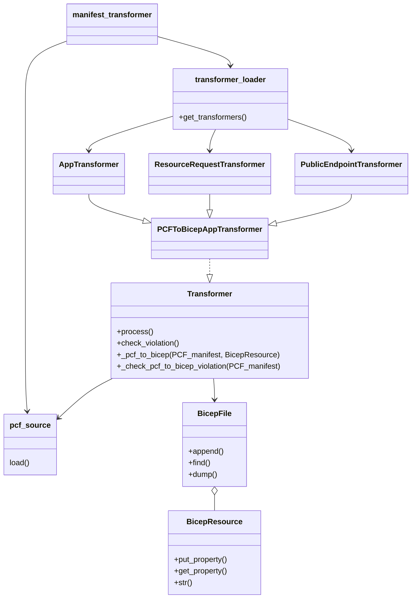

# Code Hiarachy

The `manifest_transformer` is the main entry of the transformer. It loads the transformers from a `transfomer_loader` and feeds the `BicepFile` and `pcf_manifest` to the `Trasnformer`. All the transformers loaded from `transformer_loader` should implements `Transformer` interface.

# Test
There is a roundtrip test against folder `src\spring\azext_spring\tests\latest\pcf_2_bicep`. 
1. You can  add your input PCF yaml as `<some-specific-name>.yml` and expected bicep file in `<some-specifc-name>.bicep` under this folder.
1. Git stage these files
1. Run `azdev test spring.test_asa_import_manifest --discover`
1. If the test failed, there is a error message to suggest you run the `az spring import-manifest -s <source> -d <dest>`. Copy that command and run it.
1. Check the `<some-specifc-name>.bicep` git diff to see the difference between the expectation and actual.

# Contribution
If you want to map a value in PCF manifest to Bicep resource file, 
1. You can reference the `_env_transformer.py` to map the `deployment.properties.deploymentSettings.environmentVariables` to create your own transformer.
2. Add the Transformer to `transformer_loader`
3. Update the test

Sample commit https://github.com/yuwzho/azure-cli-extensions/commit/a2aedb2e6f137a9852660fead746376b4f138f0e

# TODOs
- Transform parameter files
- Duplicate Parameter
- App name with parameter