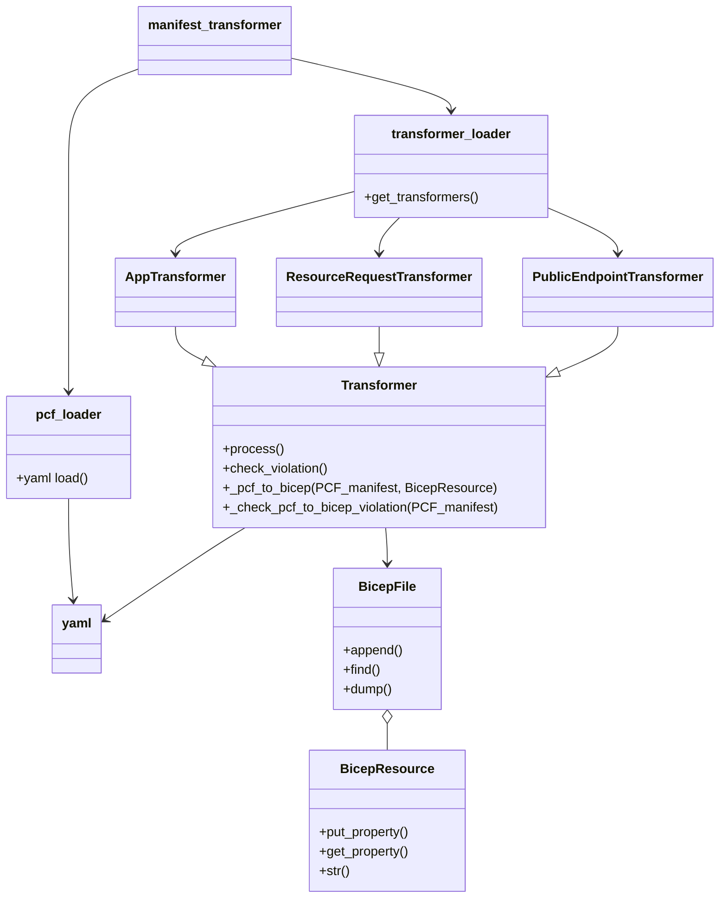

# Code Hiarachy

The `manifest_transformer` is the main entry of the transformer. It loads the transformers from a `transfomer_loader` and feeds the `BicepFile` and `pcf_manifest` to the `Trasnformer`. All the transformers loaded from `transformer_loader` should implements `Transformer` interface.

# Test
There is a roundtrip test against folder `src\spring\azext_spring\tests\latest\pcf_2_bicep`. 
1. You can  add your input PCF yaml as `<some-specific-name>.yml` and expected bicep file in `<some-specifc-name>.bicep` under this folder.
1. Git stage these files
1. Run `azdev test spring.test_asa_import_manifest --discover`

# Contribution
If you want to map a value in PCF manifest to Bicep resource file, 
1. You can reference the `ResourceRequestTransformer` to map the `cpu` `memory` to `Deployment.properties.deploymentSettings.resourceRequests` to create your own transformer.
2. Add the Transformer to `transformer_loader`

# TODOs
- Warning on properies on PCF manifest but not processed.
- [Optional] Can abstract the get and `put_properties`? The transformer can just fulfill the source property and dest property with 2 string.
